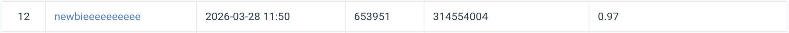

# VRDL Lab1 Image Classification

- Student ID: 314554004
- Name: 黃靖恩

## Introduction
In this lab, we implement a deep learning-based image classification system for the cv\_hw1\_data dataset. The dataset contains images from 100 categories, and the task is challenging because many classes have subtle visual differences. In this homework setting, 21,024 images are provided for training and 2,344 for testing, which makes the model less prone to overfitting.

To address this issue, several strategies are adopted. First, multiple data augmentation methods are applied to increase data diversity and improve generalization. Second, transfer learning with pretrained CNN backbones is used to accelerate convergence and improve performance. Third, five-fold cross validation is applied to obtain a more reliable estimate of model performance and reduce bias from a single train-validation split. Finally, an ensemble strategy is used during inference by combining the predictions from multiple strong models.

The experimental results show that these techniques effectively improve classification accuracy. Starting from a ResNet50 baseline, the final system further improves performance by using ResNeXt101 together with five-fold cross validation and model ensembling.


## Environment Setup

If you are using conda, you may first create and activate an environment, for example:

```bash
conda create -n lab1_class python=3.12 -y
conda activate lab1_class
pip install -r requirements.txt
```

It is recommended to create a virtual environment first, then install the required packages from `requirements.txt`.

```bash
pip install -r requirements.txt
```


## File Structure
```
Lab1_ImageClassification/
├── data/
│   ├── train/
│   │   ├── 0/
│   │   ├── 1/
│   │   ├── ...
│   │   └── 99/
│   │      ├── 0a193688-fdcf-4657-8ac2-3f88e0414bb2.jpg
│   │      └── ...
│   │
│   ├── val/
│   │   ├── 0/
│   │   ├── 1/
│   │   ├── ...
│   │   └── 99/
│   │      ├── 1cf73daf-1faa-428d-9aa1-23d8c370820a.jpg
│   │      └── ...
│   │
│   └── test/
│       ├── 0a8b2b38-4727-4dcd-b440-9532daa1f5ab.jpg
│       └── ...
│
├── data_preprocessed/
│   ├── train/
│   │   ├── 0a0f5110-0792-4a06-b8af-c5c2a6691e6c.jpg
│   │   └── ...
│   │
│   ├── test/
│   │   ├── 0a8b2b38-4727-4dcd-b440-9532daa1f5ab.jpg
│   │   └── ...
│   │
│   ├── fold/
│   │   ├── fold1.txt
│   │   └── ...
│   │
│   └── test_images.txt
│
├── src/
│   ├── datamodule.py
│   ├── model.py
│   ├── trainer.py
│   └── transforms.py
│
├── ckpt/
├── download_cv_hw1_data.sh
├── 0_data_preprocessing.py
├── 1_train.py
├── 2_ensemble.py
├── requirements.txt
└── README.md
```


## Download cv_hw1_data Dataset
Run the commend:
```
bash download_cv_hw1_data.sh

```

## Create Folds
```
python 0_data_preprocessing.py --source-root data --output-root data_preprocessed --num-folds 5 --clear-output
```

This script will:
- create `data_preprocessed/train` and `data_preprocessed/test`
- generate fold files in `data_preprocessed/fold/fold1.txt ... foldK.txt`

You can change fold count with `--num-folds K` and random seed with `--seed`.
By default files are copied; you can use `--transfer hardlink` or `--transfer symlink`.


## Training
```
python 1_train.py --model resnext101_64x4d --batch_size 45 --image_size 600 600 --save_path ckpt_resnext101_64_is600_bs45

```


## Inference
```
python 2_ensemble.py  --model resnext101_64x4d --batch_size 45 --image_size 600 600 --save_path ckpt_resnext101_64_is600_bs45
```


## Performance Snapshot
