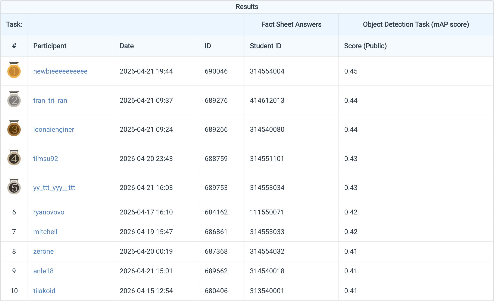

# LAB2 Digit Detection

This repository contains the full implementation for Lab 2: digit detection in
natural images.  The project is organized into two detector codebases:

- `DETR/`: a self-contained ResNet-50 DETR baseline.
- `Co-DETR/`: the stronger Co-DETR / Co-DINO pipeline built on the MMDetection
  2.x style codebase.

The final leaderboard submission uses Co-DINO with a ResNet-50 backbone,
mosaic/mixup training, multi-scale horizontal-flip test-time augmentation, and
super-resolution preprocessing.  The best submitted result reached about
`0.45` mAP on the leaderboard.

## Introduction

The task is to detect digits `0` through `9` with bounding boxes.  The dataset
is challenging because the original images are small and many digit boxes are
only a few pixels wide.  This makes localization quality more important than a
plain classification pipeline.

The project explores three main stages:

1. A vanilla DETR-style baseline under `DETR/`.
2. A stronger Co-DINO / Co-DETR detector under `Co-DETR/`.
3. A final super-resolution experiment that restores low-resolution digit
   images before training and inference.

Important project files:

```text
.
├── DETR/                         # Standalone DETR baseline
├── Co-DETR/                      # Co-DINO / Co-DETR implementation
├── TAIR/                         # Text-aware image restoration repository
├── download_dataset.sh           # Dataset download helper
├── ensemble_predictions.py       # Submission ensembling utility
├── score_submission.py           # Local COCO-style submission scorer
├── report.tex                    # Final report source
├── nycu-hw2-data/                # Original dataset
└── nycu-hw2-data_tair_1024/      # Super-resolved 1024px dataset
```

## Environment Setup

### 1. Download the dataset

From the repository root:

```bash
bash download_dataset.sh
```

Expected dataset locations:

```text
nycu-hw2-data/train/
nycu-hw2-data/valid/
nycu-hw2-data/test/
nycu-hw2-data/train.json
nycu-hw2-data/valid.json
```

### 2. DETR baseline environment

Create a lightweight Python environment for the standalone DETR baseline:

```bash
conda create -n lab2-detr python=3.12 -y
conda activate lab2-detr

pip install -U pip setuptools wheel
pip install torch torchvision --index-url https://download.pytorch.org/whl/cu124
pip install -r DETR/requirements.txt
```

If your GPU machine uses a different CUDA/PyTorch build, install the matching
PyTorch wheel first, then install the remaining Python dependencies.

### 3. Co-DETR environment

The Co-DETR codebase uses an MMDetection 2.x style stack with a locally patched
modern MMCV build.  A known working setup for A6000 machines is:

```bash
conda create -n codetr python=3.12 -y
conda activate codetr

pip install -U pip wheel packaging
pip install "setuptools<81"
pip install torch==2.6.0 torchvision==0.21.0 --index-url https://download.pytorch.org/whl/cu124
pip install six addict yapf==0.40.1 timm pycocotools opencv-python matplotlib tensorboard
```

If the machine does not provide `nvcc`, install a user-space CUDA toolkit into
the conda environment:

```bash
conda install -c nvidia cuda-toolkit=12.4 -y
```

Build MMCV from the patched helper script:

```bash
cd Co-DETR
TORCH_CUDA_ARCH_LIST=8.6 MAX_JOBS=8 bash tools/setup_modern_mmcv.sh
pip install -v -e .
```

Notes:

- Use `TORCH_CUDA_ARCH_LIST=8.6` for RTX A6000.
- Use a CUDA/PyTorch build with Blackwell support for RTX PRO 6000 Blackwell
  machines.  The successful Blackwell training logs used CUDA/NVCC 13.0 and
  PyTorch `2.11.0+cu130`.
- If `mmdet` cannot be imported, run `pip install -v -e .` again inside
  `Co-DETR/`.

### 4. Optional TAIR super-resolution setup

The final experiment uses the downloaded `TAIR/` repository for text-aware
image restoration.  Keep it next to `Co-DETR/`:

```text
Lab2_DigitDetection/
├── Co-DETR/
└── TAIR/
```

Install TAIR dependencies in the environment recommended by that repository.
The root helper script `super_resolve_coco_dataset.py` can
also run with a bicubic backend for smoke testing before running the full TAIR
restoration path.

## Usage

### Train the DETR baseline

```bash
cd DETR
python train.py --config configs/detr_r50.yaml
```

Monitor TensorBoard logs:

```bash
tensorboard --logdir outputs
```

### Train the Co-DINO baseline

```bash
cd Co-DETR
CUDA_VISIBLE_DEVICES=0,1,2,3 ./tools/dist_train.sh \
  projects/configs/co_dino_digit/co_dino_5scale_9encoder_lsj_r50_3x_digits.py \
  4 \
  work_dirs/codino_r50_baseline \
  --cfg-options data.samples_per_gpu=4
```

### Train the Co-DINO mosaic/mixup experiment

```bash
cd Co-DETR
CUDA_VISIBLE_DEVICES=0,1,2,3 ./tools/dist_train.sh \
  projects/configs/co_dino_digit/co_dino_5scale_9encoder_lsj_r50_3x_digits_mosaic-mixup.py \
  4 \
  work_dirs/codino_r50_mosaic_mixup \
  --cfg-options data.samples_per_gpu=4
```

This config uses probabilistic mosaic/mixup and disables multi-image
augmentation in the last training epochs.

### Generate the super-resolution dataset

Smoke test the SR conversion with bicubic resizing:

```bash
python super_resolve_coco_dataset.py \
  --backend bicubic \
  --data-root nycu-hw2-data \
  --output-root nycu-hw2-data_tair_1024 \
  --splits train valid test \
  --target-size 1024 \
  --resize-mode long-edge
```

For the final TAIR experiment, use the TAIR backend and checkpoint configured
for your machine.  The script scales labeled COCO bounding boxes for
`train/valid`.

### Train the super-resolution Co-DINO experiment

Point the SR config to the generated SR dataset, then train:

```bash
cd Co-DETR
CUDA_VISIBLE_DEVICES=0,1,2,3 ./tools/dist_train.sh \
  projects/configs/co_dino_digit/co_dino_5scale_9encoder_lsj_r50_3x_digits_mosaic-mixup_sr1024.py \
  4 \
  work_dirs/codino_r50_mosaic-mixup_sr \
  --cfg-options data.samples_per_gpu=4
```

### Evaluate a checkpoint on validation data

```bash
cd Co-DETR
CUDA_VISIBLE_DEVICES=0 python tools/test.py \
  projects/configs/co_dino_digit/co_dino_5scale_9encoder_lsj_r50_3x_digits.py \
  work_dirs/codino_r50_baseline/latest.pth \
  --eval bbox
```

### Export `pred.json` for submission

Baseline or non-SR inference:

```bash
cd Co-DETR
CUDA_VISIBLE_DEVICES=0 python tools/export_pred_json.py \
  projects/configs/co_dino_digit/co_dino_5scale_9encoder_lsj_r50_3x_digits.py \
  work_dirs/codino_r50_baseline/latest.pth \
  --image-dir ../nycu-hw2-data/test \
  --tta-scales 896 1024 \
  --tta-hflip \
  --score-threshold 0.75 \
  --output-json outputs/pred.json \
  --zip-output \
  --batch-size 4
```

Super-resolution inference maps predictions back to the original image size:

```bash
cd Co-DETR
CUDA_VISIBLE_DEVICES=0 python tools/export_pred_json.py \
  projects/configs/co_dino_digit/co_dino_5scale_9encoder_lsj_r50_3x_digits_mosaic-mixup_sr1024.py \
  work_dirs/codino_r50_mosaic-mixup_sr/latest.pth \
  --image-dir ../nycu-hw2-data_tair_1024/test \
  --output-coordinate-image-dir ../nycu-hw2-data/test \
  --tta-scales 896 1024 \
  --tta-hflip \
  --score-threshold 0.75 \
  --output-json outputs/ensemble/pred_CoDETR_ttascales896-1024_hflip_thr75_mosaic-mixup_sr.json \
  --zip-output \
  --batch-size 4
```

Final submission artifact:

```text
Co-DETR/outputs/ensemble/pred_CoDETR_ttascales896-1024_hflip_thr75_mosaic-mixup_sr.zip
```

### Ensemble selected submissions

Use the ensembling utility to combine selected `pred.json` or `.zip` files:

```bash
python ensemble_predictions.py \
  --output-json Co-DETR/outputs/ensemble/final.json \
  --zip-output \
  Co-DETR/outputs/ensemble/pred_CoDETR_ttascales896-1024_hflip_thr75_mosaic-mixup_sr.zip \
  Co-DETR/outputs/another_submission.zip
```

Run `python ensemble_predictions.py --help` for threshold and fusion options.

## Performance Snapshot



| Method | Main setting | Score / metric |
| --- | --- | --- |
| DETR-R50 baseline | `DETR/configs/detr_r50_strong.yaml` | ~0.36 leaderboard mAP |
| Co-DINO-R50 baseline | 1024px training, multi-scale TTA | ~0.42-0.43 leaderboard mAP |
| Co-DINO-R50 + Mosaic/MixUp | probabilistic mosaic/mixup, late shutoff | ~0.43 leaderboard mAP |
| Co-DINO-R50 + Mosaic/MixUp + SR | TAIR SR preprocessing, 896/1024 TTA + hflip | ~0.45 leaderboard mAP |

Validation-log snapshot from the three Co-DETR runs:

| Work directory | Best logged `val/bbox_mAP` |
| --- | --- |
| `Co-DETR/work_dirs/codino_r50_baseline` | 0.493 |
| `Co-DETR/work_dirs/codino_r50_mosaic_mixup` | 0.515 |
| `Co-DETR/work_dirs/codino_r50_mosaic-mixup_sr` | 0.564 |

The final best submission was:

```text
Co-DETR/outputs/ensemble/pred_CoDETR_ttascales896-1024_hflip_thr75_mosaic-mixup_sr.zip
```
