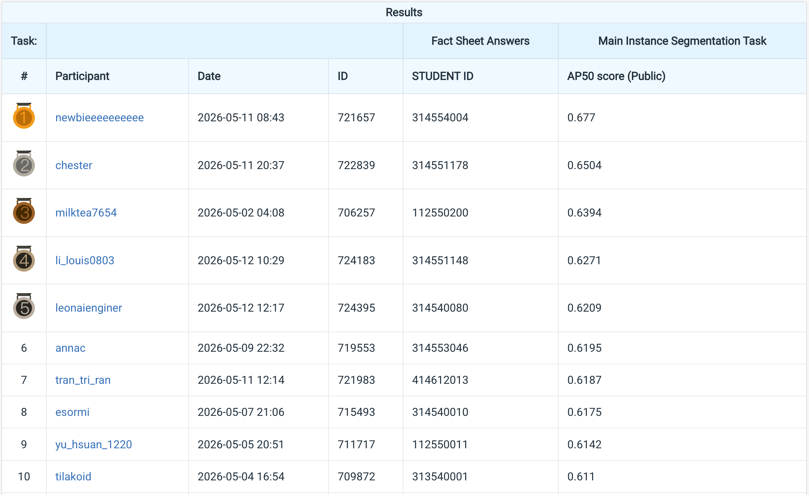

# VRDL Lab 3 Instance Segmentation

- Student ID: 314554004
- Name: 黃靖恩

## Introduction

This folder contains the code used for the Lab 3 instance segmentation
experiments. The final solution is based on Hybrid Task Cascade (HTC) with a
Swin-B backbone. HTC is still in the Mask R-CNN family because it keeps the same
two-stage structure: an RPN proposes regions, RoIAlign extracts RoI features,
and RoI heads perform classification, bounding-box regression, and mask
prediction. The Swin-B transformer is used as the backbone, while HTC adds
cascade refinement, interleaved box/mask heads, mask information flow, and an
auxiliary semantic branch.

The submitted experiments include COCO-format data preparation, Copy-Paste,
Random Erasing, FlipD4 geometry augmentation, dense inference, manual TTA,
prediction ensembling, Rare-Class Copy-Paste, mask-loss-weight finetuning, and
pseudo-label self-finetuning.

Only code is included here. Datasets, checkpoints, work directories, exported
ZIP submissions, and generated leaderboard artifacts are intentionally excluded.

## Environment Setup

The scripts assume the project root layout used during development:

```text
./
  configs/
  scripts/
  custom_transforms.py
  data/
  checkpoints/
  external/mmdetection/
```

If running from another path, either edit the absolute paths in the configs and
scripts or set the `ROOT` environment variable for shell scripts that support it.

Create and activate the conda environment:

```bash
conda create -n segmentation python=3.9 -y
conda activate segmentation
```

Install PyTorch, MMDetection dependencies, and this project's Python
requirements. The exact CUDA/PyTorch build should match the target machine:

```bash
pip install -r requirements.txt
bash scripts/setup_swin_detection.sh
```

Expected external files:

```text
data/                         # raw and processed dataset, not included
checkpoints/swin_base_patch4_window7_224_22k.pth
external/mmdetection/          # MMDetection checkout
```

## Experiment Configs

Use configs with MMDetection's training launcher:

```bash
cd .
conda activate segmentation
TORCH_FORCE_NO_WEIGHTS_ONLY_LOAD=1 \
bash external/mmdetection/tools/dist_train.sh CONFIG GPUS --work-dir WORK_DIR
```

Available configs:

Baseline HTC Swin-B model for the cell instance segmentation dataset.
```text
configs/htc_swin_b.py
```

Baseline plus shape-aware Copy-Paste augmentation.
```text
configs/htc_swin_b_copypaste.py
```

Copy-Paste plus photometric distortion ablation.
```text
configs/htc_swin_b_copypaste_photometric.py
```

Copy-Paste plus mask-aware Random Erasing.
```text
configs/htc_swin_b_copypaste_random-erasing.py
```

Dense inference config with larger RPN and RCNN output caps.
```text
configs/htc_swin_b_copypaste_dense-rpn6000-rcnn1000.py
```

Train-all Copy-Paste + Random Erasing + FlipD4 geometry augmentation.
```text
configs/htc_swin_b_copypaste_all_random-erasing_flipd4.py
```

FlipD4 experiment with Rare-Class Copy-Paste.
```text
configs/htc_swin_b_copypaste_all_random-erasing_flipd4_rarecp.py
```

Mask-loss-weight and higher mask-resolution finetuning ablation.
```text
configs/htc_swin_b_copypaste_all_random-erasing_mask56_ft.py
```

Pseudo-label self-finetuning config. It loads the FlipD4 checkpoint, trains for
8 finetuning epochs, and expects a pseudo-label COCO file generated by
`scripts/build_pseudo_label_coco.py`.
```text
configs/htc_swin_b_copypaste_all_random-erasing_flipd4_pseudolabel.py
```


## Usage

### `scripts/setup_swin_detection.sh`

Prepare the MMDetection/Swin environment.

```bash
bash scripts/setup_swin_detection.sh
```

### `scripts/prepare_coco.py`

Convert the raw dataset into COCO instance segmentation files, RGB PNG images,
and semantic maps for HTC.

```bash
python scripts/prepare_coco.py \
  --data-root data \
  --output-root data/processed
```

### `scripts/export_results.py`

Run inference on test images and export `test-results.json` plus an optional ZIP
submission.

```bash
python scripts/export_results.py \
  --config configs/htc_swin_b_copypaste_all_random-erasing_flipd4.py \
  --checkpoint work_dirs/EXP/epoch_24.pth \
  --processed-root data/processed \
  --output sweep_outputs/example/test-results.json \
  --zip-output sweep_outputs/example/submission.zip \
  --device cuda:0 \
  --score-thr 0.006 \
  --mask-thr-binary 0.60 \
  --rpn-nms-pre 6000 \
  --rpn-max-per-img 6000 \
  --rcnn-max-per-img 2200
```

Use `--test-scale 1600 960` to reproduce the larger-resolution inference
ablation.


### `scripts/export_results_tta.py`

Run manual mask-safe TTA and merge views with mask-IoU NMS.

```bash
python scripts/export_results_tta.py \
  --config configs/htc_swin_b_copypaste_dense-rpn6000-rcnn1000.py \
  --checkpoint work_dirs/EXP/epoch_30.pth \
  --views orig,hflip,vflip,hvflip \
  --score-thr 0.008 \
  --nms-iou 0.50 \
  --output sweep_outputs/tta/test-results.json \
  --zip-output sweep_outputs/tta/submission.zip
```

### `scripts/merge_predictions.py`

Merge JSON/ZIP submissions with optional per-model score weights.

```bash
python scripts/merge_predictions.py \
  sweep_outputs/model_a.zip \
  sweep_outputs/model_b.zip \
  --weights 1.0 1.0 \
  --score-thr 0.006 \
  --nms-iou 0.60 \
  --max-per-img 1000 \
  --output sweep_outputs/ensembles/merged.json \
  --zip-output sweep_outputs/ensembles/merged.zip
```

### `scripts/build_pseudo_label_coco.py`

Convert a teacher submission into pseudo labels and combine them with the
train-all annotation file.

```bash
python scripts/build_pseudo_label_coco.py \
  --submission sweep_outputs/ensembles/teacher.zip \
  --train-ann data/processed/annotations/instances_train_all.json \
  --test-images-ann data/processed/annotations/test_images.json \
  --score-thr 0.20 \
  --max-per-img 1000 \
  --output data/processed/annotations/instances_train_all_plus_pseudo.json
```

### `scripts/run_pseudolabel_train.sh`

Build pseudo labels and launch pseudo-label self-finetuning.

```bash
GPUS=2 \
CUDA_VISIBLE_DEVICES=0,1, \
PSEUDO_SUBMISSION=sweep_outputs/ensembles/teacher.zip \
PSEUDO_ANN=data/processed/annotations/instances_train_all_plus_pseudo.json \
bash scripts/run_pseudolabel_train.sh
```


## Notes

- Checkpoints and data are not included in this folder.

## Performance Snapshot

