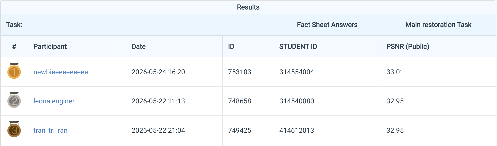

# HW4 Image Restoration Reimplementation

- Student ID: 314554004
- Name: 黃靖恩

This folder contains the code used to train and test the PromptIR restoration
system described in the report.  The final pipeline is:

1. train a rain/snow classifier from the provided degraded training images;
2. train one PromptIR specialist on rain pairs and one on snow pairs;
3. route each test image with the classifier and merge the specialist outputs
   into one `pred.npz` submission.

## Files

- `models/promptir.py`: PromptIR restoration model.
- `train.py`: PromptIR training script with `--kind-filter all|rain|snow`.
- `train_weather_classifier.py`: rain/snow classifier training and prediction.
- `predict_promptir_specialists.py`: routed rain/snow specialist inference.
- `run_specialists.sh`: convenience script for specialist training and routed prediction.
- `check_submission.py`: validates the final `pred.npz`.
- `data.py`, `inference_utils.py`: dataset and inference helpers.

## Dataset Layout

Put the provided dataset under `data/` or pass another path with `DATA_ROOT`.

```text
data/
  train/
    degraded/
      rain-1.png ... rain-1600.png
      snow-1.png ... snow-1600.png
    clean/
      rain_clean-1.png ... rain_clean-1600.png
      snow_clean-1.png ... snow_clean-1600.png
  test/
    degraded/
      0.png ... 99.png
```

## Environment

Create the conda environment:

```bash
conda create -n restoration python=3.12 -y
conda activate restoration
python -m pip install torch==2.11.0+cu130 torchvision==0.26.0+cu130 \
  --index-url https://download.pytorch.org/whl/cu130
python -m pip install numpy pillow tqdm einops pyyaml tensorboard matplotlib pandas scikit-image
```

If your CUDA wheel differs, install the matching PyTorch build for your machine.

## Train the Weather Classifier

```bash
python train_weather_classifier.py \
  --run-name weather_classifier_resnet18_rgbres_ep20 \
  --epochs 20 \
  --batch-size 64 \
  --model resnet18 \
  --input-mode rgb_residual \
  --lr 3e-4 \
  --num-workers 8 \
  --amp bf16
```

The classifier writes:

```text
runs/weather_classifier_resnet18_rgbres_ep20/best.pt
runs/weather_classifier_resnet18_rgbres_ep20/test_weather_classifier_predictions.csv
```

## Train Specialists and Create Submission

Single GPU:

```bash
GPUS=0 NPROC=1 BATCH_SIZE=4 ./run_specialists.sh
```

Multi-GPU:

```bash
GPUS=0,1,2 NPROC=3 BATCH_SIZE=6 ./run_specialists.sh
```

The script trains:

```text
runs/rain_full256_ep200/best.pt
runs/snow_full256_ep200/best.pt
```

and writes:

```text
outputs/specialists_routed_tta/pred.npz
outputs/specialists_routed_tta/submission.zip
outputs/specialists_routed_tta/routing.csv
```

## Predict Only

If the classifier and specialist checkpoints already exist:

```bash
RUN_RAIN=0 RUN_SNOW=0 RUN_PREDICT=1 \
GPUS=0 NPROC=1 \
./run_specialists.sh
```

## Manual Routed Prediction

```bash
python predict_promptir_specialists.py \
  --rain-checkpoint runs/rain_full256_ep200/best.pt \
  --snow-checkpoint runs/snow_full256_ep200/best.pt \
  --classifier-csv runs/weather_classifier_resnet18_rgbres_ep20/test_weather_classifier_predictions.csv \
  --input-dir data/test/degraded \
  --output-dir outputs/specialists_routed_tta \
  --batch-size 8 \
  --num-workers 8 \
  --amp bf16 \
  --tta
```

Validate the submission:

```bash
python check_submission.py outputs/specialists_routed_tta/pred.npz \
  --test-dir data/test/degraded
```

